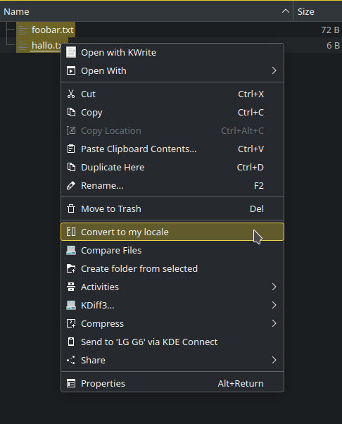

# Convert to my LOCALE

A KDE 5 dolphin context menu extension (aka Service Menu), that let's you
convert any plain text file to your locale (Language Settings) encoding via
iconv(1).

The Action will create a new file from old filename extended with the encoding
part of your locale. e.g. it will create foobar-utf-8.txt from a foobar.txt
source file, if UTF-8 is the encoding part of your $LANG (e.g. LANG=de_DE.UTF-8)
Already existing files will be overwritten without a warning.

This action is applicable to single or many file at once.

This action likely is absolutly useless to the great majority of KDE users,
with the minor exception of those, who still have a ton of old other originated
text files, that are encoded e.g. in ISO-8859-1 (~Latin1) and do want to read
these without annoying unreadable characters.

It is coded with %u (see Desktop Entry Specification), so this might work on
remote files as well. (not tested)

After Installation this new action should be available (if more than one action
applies to file(s), it will be located as a submenu under "Actions".

